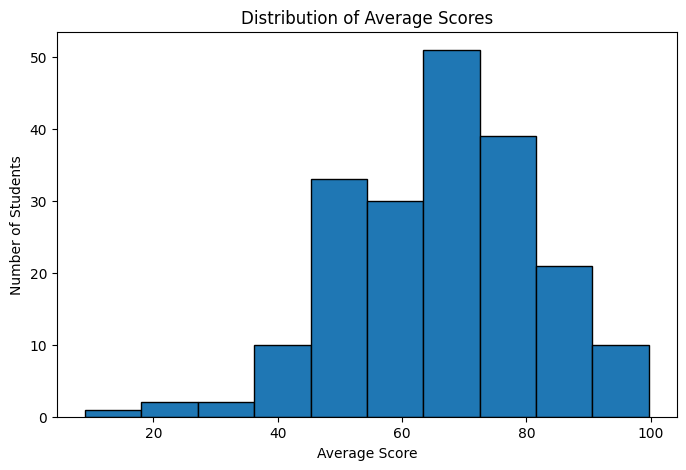
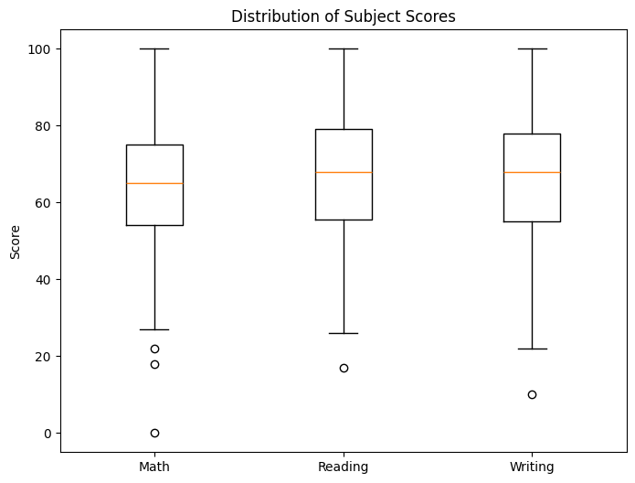
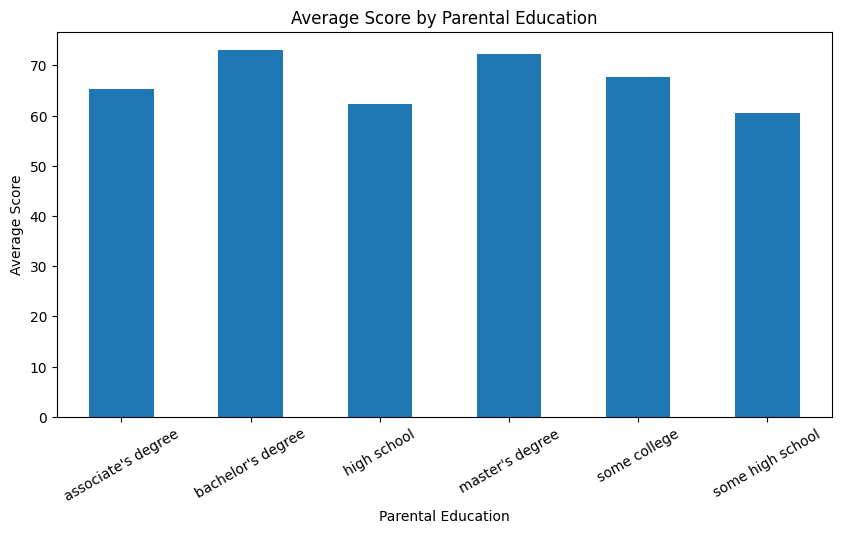

#  Student Performance Exploratory Data Analysis

Business Analytics Portfolio for MIS311 – Assignment 1

---

## Project Overview

This project performs Exploratory Data Analysis (EDA) on a Student Performance dataset using Python.

The objective is to understand student academic performance through data cleaning, descriptive statistics, and visualization.

---

##  Dataset Information

- Dataset: Student Performance
- Number of observations: 199
- Number of variables: 8

Variables:

- Gender
- Race/Ethnicity
- Parental Level of Education
- Math Score
- Reading Score
- Writing Score
- Total Score
- Average Score

---

## Data Cleaning

The following preprocessing steps were completed:

- Checked dataset size and structure
- Identified missing values
- Filled missing values
- Removed duplicate records

---

## Exploratory Data Analysis

Descriptive statistics were generated for all numerical variables.

The project also includes visualizations such as:

- Histogram of Average Scores
- Boxplot of Subject Scores
- Average Score by Parental Education

---

## Key Findings

- Reading scores have the highest average performance.
- Mathematics has the lowest average score.
- Students whose parents have Bachelor's or Master's degrees generally achieve higher average scores.

---

## Tools Used

- Python
- Pandas
- Matplotlib
- Google Colab
- GitHub

---

## Repository Contents

```text
MIS-311
│
├── README.md
├── Student_Performance_EDA.ipynb
├── 06_Student Performance.xlsx
└── images
    ├── histogram.png
    ├── boxplot.png
    └── bar_chart.png
```

---

## Data Visualizations

### Distribution of Average Scores



**Interpretation:** The average scores are approximately normally distributed, with most students scoring between 60 and 80.

---

### Distribution of Subject Scores



**Interpretation:** Reading and Writing have slightly higher median scores than Mathematics. A few outliers are observed in all subjects.

---

### Average Score by Parental Education



**Interpretation:** Students whose parents have Bachelor's or Master's degrees generally achieve higher average scores than those whose parents have lower education levels.
## Author

**Le Thi Nha Phuong**

Business Analytics Student

Eastern International University (EIU)

MIS311 – Business Analytics
---
